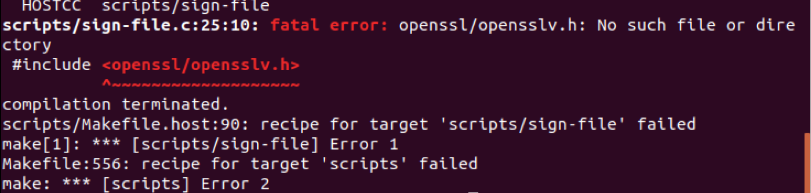
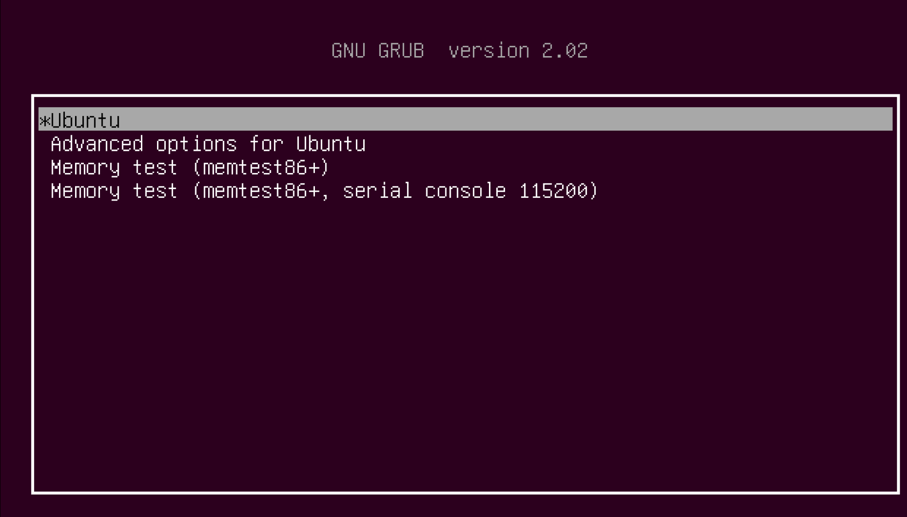
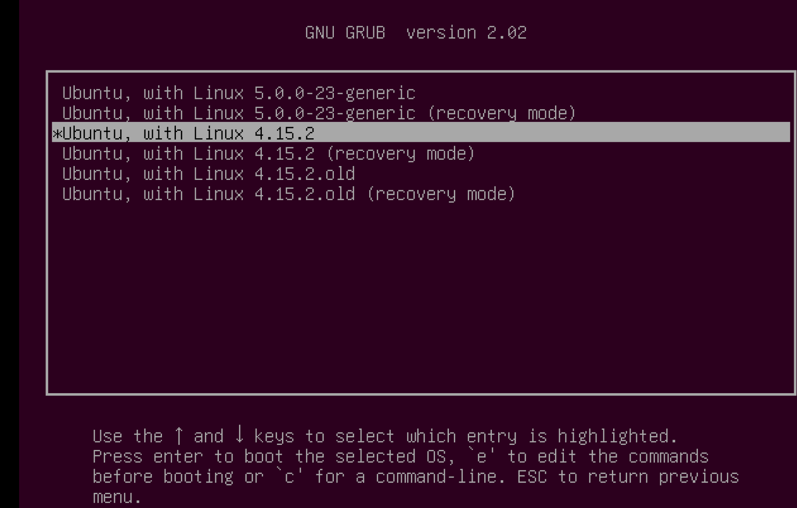
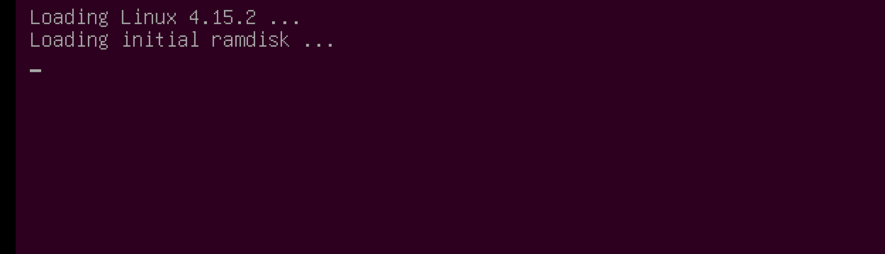

# Linux Kernel Dev Log

## Environment 

Ubuntu LTS 18..04

Kernel: Linux 4.15.2

Main ref: https://blog.csdn.net/sinat_28750977/article/details/50837996

## What to do

- Add customized sys call `asmlinkage long sys_customcp(const char *src,const char *dst);`

- Sys call number`./arch/x86/entry/syscalls/syscall_64.tbl`

- `333	64	customcp		sys_customcp`

- Declaration `./include/linux/syscalls.h`

- `asmlinkage int sys_customcp(const char *src,const char *dst);`

- Definition `arch/kernel/sys.c`

- Add code

- ```c++
  asmlinkage int sys_customcp(const char *src, const char *dst) 
  {
  	int infd, outfd, count; 
      char buf[256]; 
      mm_segment_t fs; 
      fs = get_fs(); 
      set_fs(get_ds( ));
      //Handle Error
      if((infd=sys_open(src, O_RDONLY, 0)) == -1) 
  	{ 
  		return 1; 
  	} 
      if((outfd=sys_open(dst, O_WRONLY | O_CREAT, S_IRUSR| S_IWUSR)) ==-1)
      { 
  		return 2; 
      } 
  	while((count = sys_read(infd, buf, 256)) > 0) 
      { 
  		if(sys_write(outfd, buf, count) != count)
              return 3; 
      } 
          if(count == -1) 
          	return 4; 
      sys_close(infd); 
      sys_close(outfd); 
      set_fs(fs); 
      return 0; 
  }
  ```


- [https://blog.xuite.net/eternalwind/wretch/108912717-%E3%80%90Ubuntu%E3%80%91%E9%87%8D%E7%B7%A8%E6%A0%B8%E5%BF%83%E5%AE%8C%E6%95%B4%E6%B5%81%E7%A8%8B](https://blog.xuite.net/eternalwind/wretch/108912717-[Ubuntu]重編核心完整流程)

## Compile

### Environment Check

1. gcc
2. make
3. build-essential (include g++和Linux-kernel-headers)
4. 用`make menuconfig`設定核心參數需先安裝`ncurses`
5. `sudo apt-get install ncurses-dev`
6. Save-exit


 `sudo make menuconfig`




Solution: `sudo apt-get install libssl-dev`

Done.


## Utilize

Shellcode:

```C++
#include <stdio.h>
#include <linux/kernel.h>
#include <unistd.h>
#include <string.h>
int main(int argc, char* argv[])
{
    if (argc!=3||strcmp(argv[0],"copy"))
        {
            printf("Usage: copy <src> <dst>");
        	return 0;
        }
     else
        {
            printf("Comfirm:%s %s %s\n",argv[0],argv[1],argv[2]);
            int status=syscall(333,argv[1],argv[2]);
            if (status==1)
            {
                printf("Failed: Unable to open arc file\n");
            }
            else if (status==2)
            {
                printf("Failed: Unable to open dst file\n");
            }
            else if (status==3)
            {
                printf("Failed: Buffer Overflow\n");
            }
            else if (status==4)
            {
                printf("Failed: Error while cpoying\n");
            }
            else if (!status)
            {
                printf("Success!\n");
            }
            return 0;
        }
}
```

## Bugfix

Re-Compile:

```bash
sudo make modules_install 
sudo make install
```

Then:

`etc/default/grub`

Change it as writeable file:

```bash
 sudo chmod 666 grub
```

```
GRUB_TIMEOUT=0
```

to:

```
GRUB_TIMEOUT=20
```

And save.

Then update:

```bash
sudo update-grub
```

### Kernel Change

==Cautions!== Close user manager before reboot! Or it will stay before logging in.

See: https://blog.csdn.net/qq_30501975/article/details/80298252

Reboot. Press Esc as fast as possible

to the Grub.



Advanced Option:



Then:



### Log information


For more information.

### Other Useful Instructions ==Cautions!!!==

Ref: https://blog.csdn.net/jisuanji_wjfioj/article/details/43415773

查看需要更新的内核命令：

apt-cache search Linux

该命令将会显示所有可以获取的内核

安装后，reboot即可，重启后，既是以新内核启动

如果要换回原来的内核，比如，原来是3.2，则先使用命令


1. grep menuentry /boot/grub/grub.cfg
该命令显示内核的顺序，比如显示为：


```
menuentry 'Ubuntu, with Linux 3.2.17experimental' --class ubuntu --class gnu-linux --class gnu --class os {
menuentry 'Ubuntu, with Linux 3.2.17experimental (recovery mode)' --class ubuntu --class gnu-linux --class gnu --class os {
menuentry 'Ubuntu, with Linux 3.2.17-chipsee' --class ubuntu --class gnu-linux --class gnu --class os {
menuentry 'Ubuntu, with Linux 3.2.17-chipsee (recovery mode)' --class ubuntu --class gnu-linux --class gnu --class os {
menuentry 'Ubuntu, with Linux 3.2.0-23-generic' --class ubuntu --class gnu-linux --class gnu --class os {
menuentry 'Ubuntu, with Linux 3.2.0-23-generic (recovery mode)' --class ubuntu --class gnu-linux --class gnu --class os {
menuentry "Memory test (memtest86+)" {
menuentry "Memory test (memtest86+, serial console 115200)"
```


2. 假设你要以3.2.17内核版本启动，则将文件/etc/default/grub中
`GRUB_DEFAULT=0`

改为

`GRUB_DEFAULT=2`

保存后

然后使用命令

`sudo update-grub`

==重启后，使用命令`uname -a`查看，内核即为你想要的内核==


---

memtest??

See https://blog.csdn.net/zhangjs0322/article/details/8686775

Or https://blog.csdn.net/mls805379973/article/details/77368829

---

## Auto Deploy Shell

```bash
# Env Check
sudo apt-get update
sudo apt-get install gcc
sudo apt-get install make
sudo apt-get install build-essential
sudo apt-get install ncurses-dev
sudo apt-get install libssl-dev
echo "Environment Check Finished..."

# Deploy
sudo cp -fp syscall_64.tbl ../linux-4.15.2/arch/x86/entry/syscalls/ 
sudo cp -fp syscalls.h ../linux-4.15.2/include/linux/
sudo cp -fp sys.c ../linux-4.15.2/kernel/
echo "Finished"
```

### Make Shell

```bash
cd ..
cd linux-4.15.2
echo "Start"
sudo make clean
sudo make -j4 bzImage 
echo "Image Compile Finished"
sudo make -j4 modules 
echo "Modules Finished"
sudo make -j4 modules_install 
echo "Module Installed"
sudo make -j4 install 
echo "Finished"

```

## Extra

`./makefile`:

```makefile
# SPDX-License-Identifier: GPL-2.0
VERSION = 4
PATCHLEVEL = 15
SUBLEVEL = 2
EXTRAVERSION = .POTASSIUM
NAME = Fearless Coyote
```

Add custom suffix.
