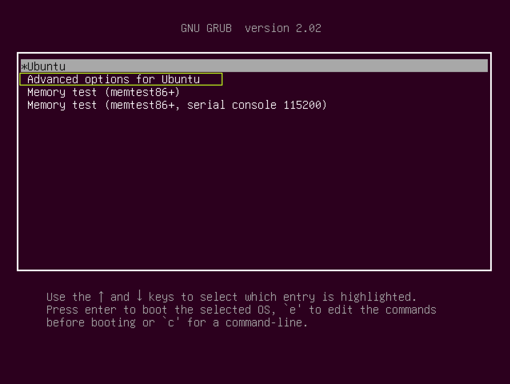
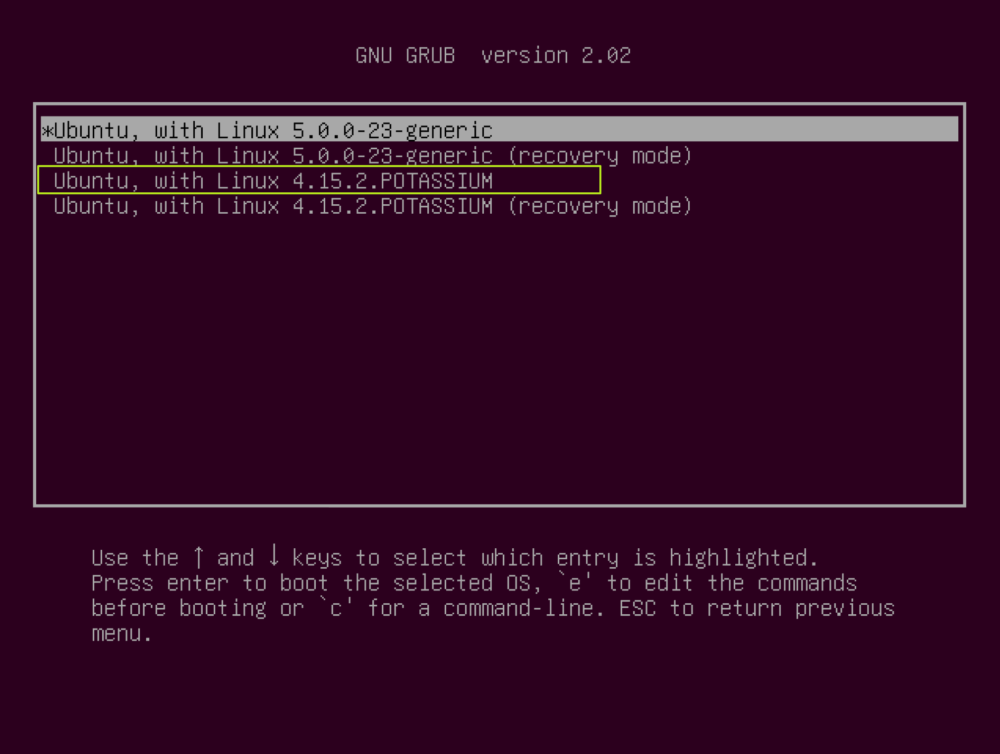
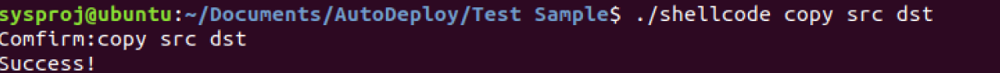

# README

## Environment Check

- Ubuntu 18.04.3 LTS

- Old Core: Linux ubuntu 5.0.0-23-generic #24~18.04.1-Ubuntu SMP Mon Jul 29 16:12:28 UTC 2019 x86_64 x86_64 x86_64 GNU/Linux
- New Core: Linux ubuntu 4.15.2.POTASSIUM #1 SMP Thu Feb 20 06:51:24 PST 2020 x86_64 x86_64 x86_64 GNU/Linux

## Reliance:

- gcc
- make
- build-essential
- ncurses-dev
- libssl-dev

## Usage

1. Download source code (`linux-4.15.2.tar.gz ` or `linux-4.15.2.tar.xz`) via https://mirror.bjtu.edu.cn/kernel/linux/kernel/v4.x/ or https://mirrors.edge.kernel.org/pub/linux/kernel/v4.x/
2. Download `AutoDeploy.zip` , unzip it to the same level as unzipped source code.
3. Grant ==two== `.sh` file with executable authority by `sudo chmod 777 <filename>`
4. Run `autodeploy.sh`
5. Manually generate `menuconfig`:
   1. `sudo make menuconfig`
   2. Save-Exit-Yes
6. Check
7. Run `autocompile.sh`
8. Wait until compile finished

---

1. `cd etc/default/grub`
2. Grant `grub` with writeable authority by ` sudo chmod 666 grub`
3. ~~`GRUB_TIMEOUT=0`~~`GRUB_TIMEOUT=20`
4. ~~`GRUB_CMDLINE_LINUX_DEFAULT="quiet"`~~ `GRUB_CMDLINE_LINUX_DEFAULT="text"`
5. Save
6. Update grub info: `sudo update-grub`
7. ==Very important== Turn on the Auto Login by the reference of https://blog.csdn.net/qq_30501975/article/details/80298252
8. Reboot.

---

1. Press `shift` to enter GNU GRUB list.

   

2. Select `Advanced options for Ubuntu`

   

3. Select `4.15.2.POTASSIUM`

4. Enter.

---

1. `cd ./AutoDeploy/TestSample`

2. Compile `shellcode.cpp` by `g++ -g shellcode.cpp -o shellcode`

3. Run `shellcode` for test.

4. Instruction sample: `./shellcode copy src dst`

5. Done.

   

   And:

   

## Appendix

For more development process and other bugfix instructions, see `Linux Core Dev Log.md`.

I-Hsien

